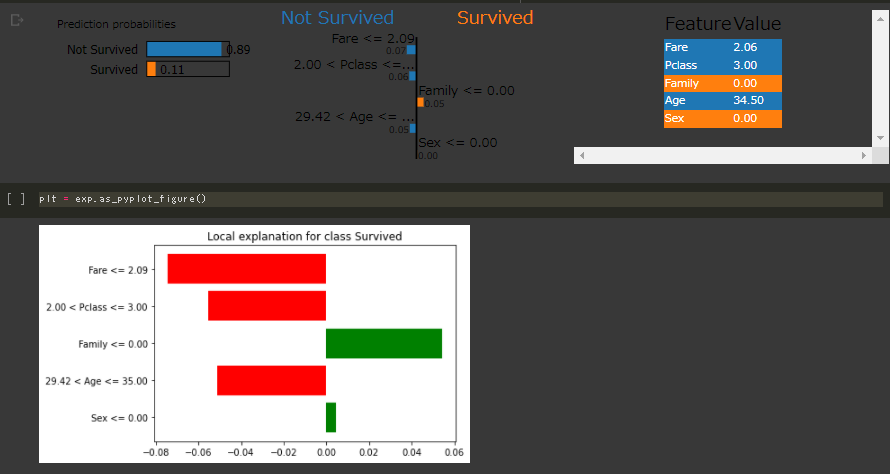
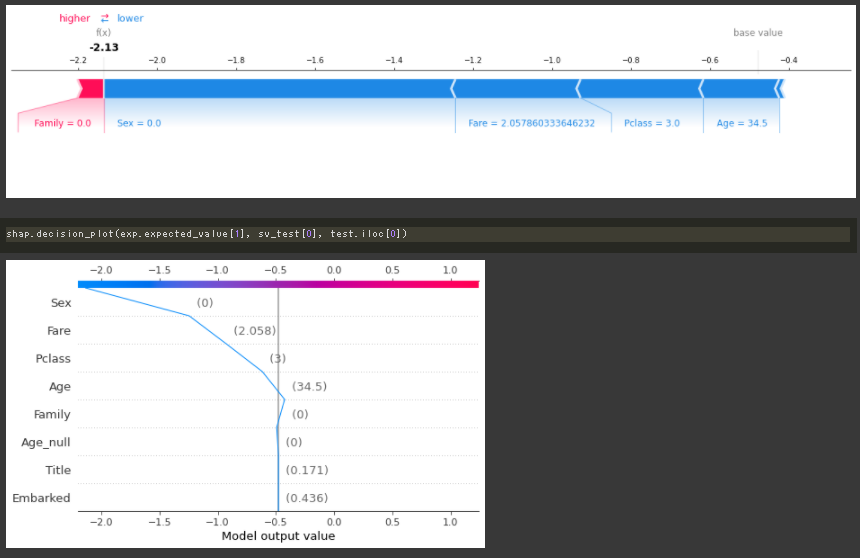
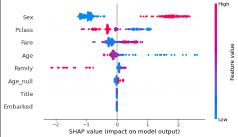
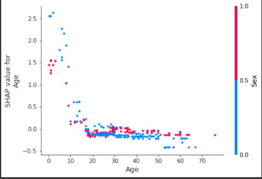

## モデル学習後の解釈理解
前提: データ探索ができている。ある程度の評価基準を満たすモデルが構築できていること.  
ツール: 
+ lime==0.2.0.1 
+ shap  
+ [pytools_table](https://github.com/kooose38/pytools_table) 自作

### あるデータ一つ当たりの判断基準を特長量から算出する  
limeによる多くのデータ型(テキスト、画像)に使える汎用的な分類説明。  
  
段階的に特長量を加えることで分類していく様子を可視。

### 全てのデータを使った寄与率  
データサンプルごとに予測を基にシャープ値を算出する。  
  

### 特長量と最も影響値の高い特長量同士の寄与率  
  

シャープ値はすべての特長量において実質的に同じ単位をとるので、クラスタ分析や主成分分析が有効的。  